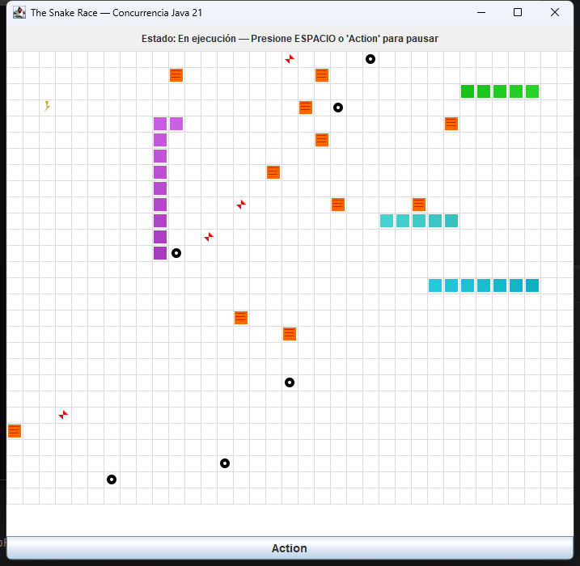
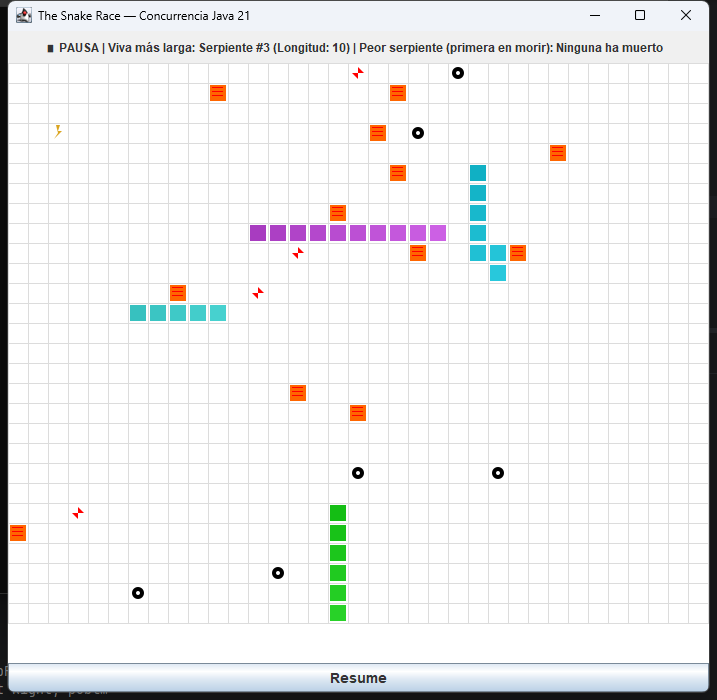
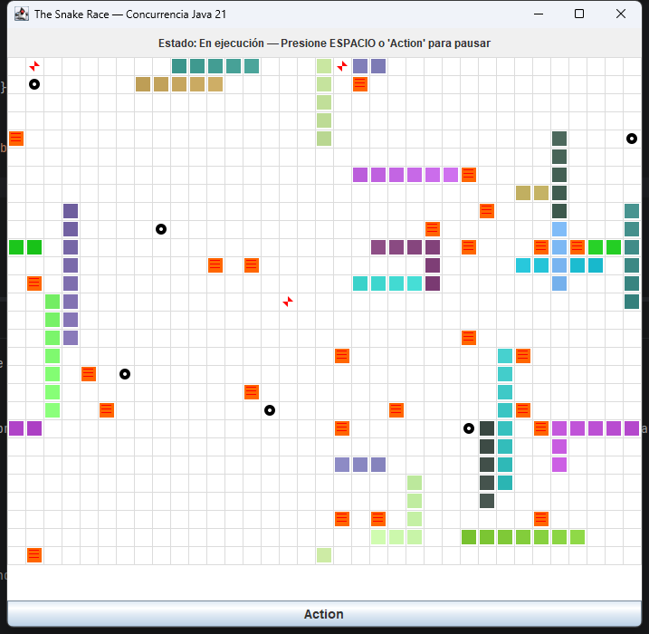
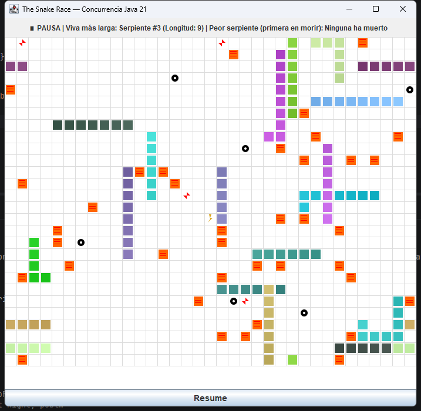

# Evidencias de ejecución — SnakeRace (ARSW Lab #2)

Capturas tomadas ejecutando la aplicación real (`mvn -q -DskipTests exec:java -Dsnakes=N`,
equivalente a `java -cp target/classes co.eci.snake.app.Main`) para verificar en vivo lo
solicitado en el `README.md` del laboratorio: build limpio (`mvn clean verify`, 6/6 tests OK),
control de ejecución (Iniciar/Pausar/Reanudar) y robustez bajo carga alta.

## 01 — Ejecución normal (4 serpientes)

`-Dsnakes=4`. Se observan las 4 serpientes autónomas (cada una en su propio hilo virtual),
ratones, obstáculos, teletransportadores (flechas rojas) y turbos (rayos) sobre el tablero
con wrap-around.

## 02 — Pausa con estadísticas (4 serpientes)

Tras presionar ESPACIO / botón *Action*: el reloj (`GameClock`) y los hilos de las serpientes
se suspenden de forma coordinada (sin *tearing*) y la barra superior muestra de forma
consistente la serpiente viva más larga y la peor serpiente (primera en morir). El botón
cambia a *Resume*.

## 03 — Robustez bajo carga alta (20 serpientes)

`-Dsnakes=20`. El juego corre de forma fluida con 20 hilos virtuales concurrentes accediendo
al tablero compartido. No se registraron excepciones de concurrencia (sin
`ConcurrentModificationException`, sin deadlocks) — stderr quedó vacío durante la corrida.

## 04 — Pausa consistente bajo carga alta (20 serpientes)

Misma corrida de 20 serpientes, pausada: las estadísticas se calculan y muestran
correctamente incluso con alta concurrencia, confirmando que la región crítica de pausa
está bien sincronizada.
